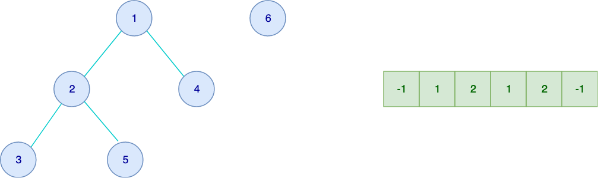
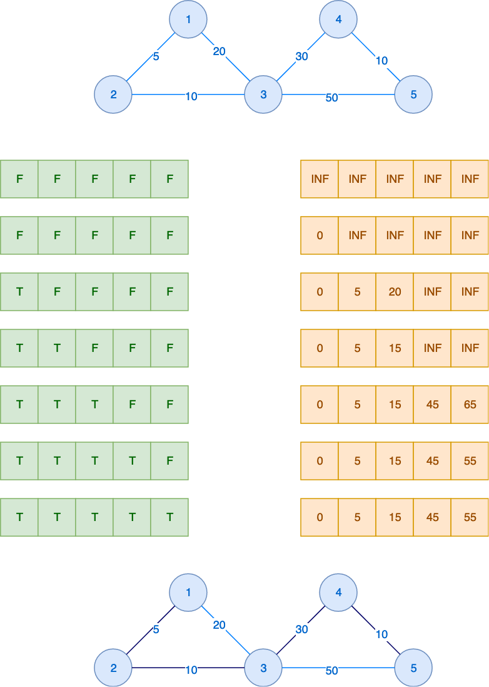
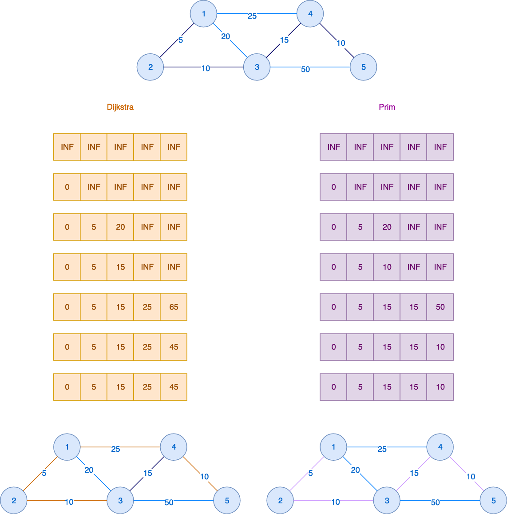
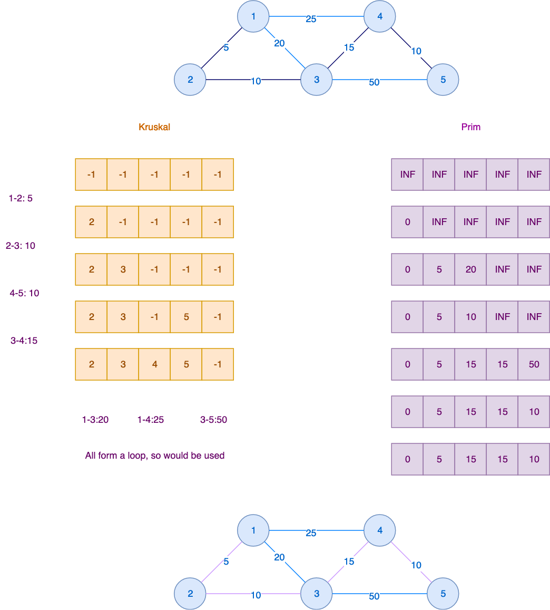

# Graph
## 1. Algorithms
### 1.1 Union and Find

#### 1.1.1 Internal Data structure
A list to storage linked parent for nodes. The task here
is to build this list using the given edges.


To do so, two methods are needed normally.
##### 1.1.2 Find
Given an edge, we want to if the nodes of both end are in the same 
tree (like node 3 and 5 above). This method takes a node and 
find its root. 
It can be a recursive function or use while loop to find 
parent until it is sys.maxsize. 

##### 1.1.3 Union
This method united two roots. Just change one root to point
to the other. 

By using these two methods, we can build a linked list like
the one above for a tree.

##### 1.1.4 Detect cycle
This algorithm can be used to detect cycle, or to filter out
cycle(s), as shown in the example (Roads and Libraries) below.

### 1.2 Dijkstra
There are two different implementations of Dijkstra algorithm.

####  1.2.1 Implementation 1
##### 1.2.1.1 Internal Data Structure
Two lists, each of size of nodes.
First list (visited) store information whether a node has been visited. 

The second list (min_dis) stores the minimum distance (so far) to the start node. Initialize even thing to -1.

##### 1.2.1.2 Useful method
Find the node with the minimum dis to start, provided it is 
not visited. 

#### #1.2.1.3 How it works
First pick a start node (or use the given one).


Initialize min_dis by setting the dis of this start node to be 0. This means this node is 0 from start. 

Start a loop for n iteration, with n being the number of node.

For each iteration, call the above method to get the min node (node_s).
Set visited of node_s to True.
For the first iteration, the start node is the only one there.
Find all the edges that contains this node as start 
(and end if bidirection). 
Update the min_dis list for the nodes (node_e) of these edges.
Note update only when the distance to node_e through node_s is
smaller than the current value of node_e in min_dis.

#### 1.2.2 Implementation 2
Use a queue and a list
##### 1.2.2.1 Data structure
A list of size of number of nodes to store the closest distance
to the corresponding node ```closest_dist```.
A queue to store the next nodes to process. 
#### 1.2.2.2 How it works
Steps:

* Initialize the queue with the start node. Initialize ```closest_dist``` of the
start node to 0.
* Use a while loop to handle all the nodes in the queue
    * For each iteration, pop a node ```n1``` from the q
    * Find all the nodes this node can connect to directly
    * Use a for loop to loop through all these nodes
        * for each ```n2``` compute the distance ```d2```to this node 
        using ```closest_dist[n1]``` plus distance from ```n1``` to ```n2```
        * _important_. Now check if ```d2``` is smaller than```clostest_dist[n2```. if so
        update ```clost_dist[n1``` and append ```d2``` to the q
        
#### Variance
Implementation 1 and 2 above can be use to find the MST. 

Implementation 2 is more flexible in the sense it can handle some
variance of MST. 

Here MST only depends on the lowest cost of each node.
Example like 2.5 below, the answer depends on more than
just the lowest cost. We can just expand the ```closest_dist``` to store
a list, instead of just a single minimum cost. Then in the 
for loop, we update ```clost_dist``` and the q only if d2 is not already
in the list ```clost_dist[n2]```.


### 1.3 Prim
Prim is used to find the MST. It is similar to Dijkstra, and the difference is 
that Dijkstra is the min sum of distance from one node to all the others.
Prim is the min sum of all edges.

So when we need to update the mis_dis, instead of using the distance trough node_s tp node_e
we just use the distance between node_s and node_e.



### 1.4 Kruskal
Kruskal is a variance of Union and Find. In Union and Find, we don't care about the 
order of edges. We just need to handle all the edges.

For Kruskal, now we handle edges with weight. So we first sort the edges according to the
weight, and then we handle them from low to high.


Kruskal can do the same thing as Prim.


### 1.5 BFS
Use a queue to do BFS.

Steps:
* Initialize the deque with root node
* do a while loop for non-empty deque
* for each iteration, get the size of the deque. 
* loop through this size
* for each iteration, pop a node from deque. 
* do whatever we need to do with this node.
* push its children to the deque.

### 1.6 DFS (in-order, pre-order, and post-order)
Use recursive approach. Have a recursive method to handle a node.

* in-order: call itself to handle the left child, then process its data, then call itself to handle the right child
* pre-order: process its data first, then call itself to handle left child, call itself to handle the right child
* post-order: call itself to handle the left, then right child. Then process its data.

## 2. Examples
### 2.1 Roads and Libraries
Union and Find is used for this [problem](https://www.hackerrank.com/challenges/torque-and-development/problem), because all the roads carry the
same cost to repair.

There are n cities and m roads. Not all cities are connected 
by roads. All roads are destroyed. 

Need to decide which road the rebuild and where to build 
libraries. Need to fulfil:
* Any city needs to
 have a library or be connected to a city with a library
 
#### 2.1.1 Approach
 Use Union and Find algorithm, because it can
 detect connected cities. 
 
 Assume that cities are grouped into clusters.
 
#### 2.1.2 Implementation
Union and Find algorithm uses a list to store 
 connected nodes. 
 On top of that, use a list of clusters to store number 
 of roads and cities in each cluster, together with the
 root city.
 
In the union method, also merge two clusters.

Python [code](roads_and_libraries.py)

### 2.2 Even Tree
DFS search is used for this [problem](https://www.hackerrank.com/challenges/even-tree/problem). Count number of sub-nodes at each node.
Straightforward.
Python [code](even_tree.py)

### 2.3 Prim's (MST): Special Subtree
[This](https://www.hackerrank.com/challenges/primsmstsub/problem) can be solved
by straightforward Prim's algorithm.

Python [code](prims_special_subtree.py). 

### 2.4 Kruskal (MST): Really Special Subtree
This [problem](https://www.hackerrank.com/challenges/kruskalmstrsub/problem) is just
a straightforward approach of Kruskal algorithm as discussed above.

Note that a line is missing in the framework code to output the result.

```fptr.write(str(res) + '\n')```

Python [code](kruskal_mst_really_special_subtree.py)

### 2.5 Minimum Penalty Path
For this [problem](https://www.hackerrank.com/challenges/beautiful-path/problem), a variant
of Dijkstra algorithm is used.

Instead of only one flag for a node to store the information whether it has been visited, 
we now use multiple flags, to allow more than one value to propagate through this node.
#### Approach 1
Use an open end list for this. Just append whatever value pass through this node to it.
Then each time, we check if a new value already exists. If so, don't append. This approach 
works but has performance issue.
#### Approach 2
Note that max(C<sub>i</sub>) is 1024, so whatever C<sub>i</sub> OR C<sub>j</sub> OR C<sub>k</sub>, 
the 2048 bit will never get set. So for each node, at most 2048 different values can 
pass through. So we use 
```
visited = [[False]*2048 for i in range(n)]
```
to store the information

Now the rest is straightforward. 

* Create a deque to store the nodes we need to handle. Need to store the node and the cost 
it will propagate.
* Put A into the deque. Set 
```
visited[A - 1][0] = True
```
* do a while loop to process all the nodes in the queue
* for each iteration, pop a node and its cost from the queue
* use the edges to find all the neighbors
* use its node and cost to propagate the edge to the next node
* check if this value has already been propagate to the neighbor or not
* if not, update visited, and add neighbor to queue.

Python [code](minimum_penalty_path.py)

### 2.6 Clique
This [problem](https://www.hackerrank.com/challenges/clique/problem) has to use this [algorithm](https://en.wikipedia.org/wiki/Tur%C3%A1n_graph)

Python [code](clique.py)

### 2.7 Jeanie's Route
This [problem](https://www.hackerrank.com/challenges/jeanies-route/problem) is quite complex. 

Key steps:
* Clean up the tree by make it minimum but still connect all the cities Jeanie needs to
deliver letters to. In this step, city 5 of the example given in the problem will be removed, 
because after that city 1, 3, and 4 are still connected.
* Pick a city and find the city a that is furthest away from it.
* Use city a to find the furthest city, and compute the distance.
* Sum up all the remaining path costs, times 2 and then substract the distance we get above.

Python [code](jeanies_route.py)

### 2.8 Breadth First Search: Shortest Reach
This [problem](https://www.hackerrank.com/challenges/bfsshortreach/problem) is
a straightforward application of BFS.

For python [implementation](breadth_first_search_shortest_reach.py), only one
extra optimization needed.

Convert the list of edges (adjacent list representation) to
list of connected nodes (adjacent matrix representation)

### 2.9 Jack goest to Rapture
This [problem](https://www.hackerrank.com/challenges/jack-goes-to-rapture/problem) can 
be solved by a variance of Dijkstra algorithm.

Use a deque to store the stations to handle. Initialize it with
the start station.

Use a list to store the lowest cost ```lowest_cost```to each station.

Use a while loop to loop through the q. For each iteration, pop a station from 
the q, and update all the stations it connects to, if
the cost is lower than the ```lowerst cost``` of it so far. If so
update ```lowest cost``` of it and add it to the queue.

Python [code](jack_goes_to_rapture.py)

### 2.10 Journey to the Moon
This [problme](https://www.hackerrank.com/challenges/journey-to-the-moon/problem) can 
be solved using the Union and Find algorithm.

At the end all the node linked together belong to the 
same country. 

Python [code](journey_to_the_moon.py)

### 2.11 Synchronous-shopping
An interesting [problem]](https://www.hackerrank.com/challenges/synchronous-shopping/problem) that can be
solved by a variance of BFS. 

In normal BFS, an array is used to keep check whether
a node has bee visited. So it just store a 
boolean. Once visited, we don't need to visited again.

But here because of the fish type being carried, a cat 
needs to re-visit a center(node). Each time, a cat can bring back different combination of fishes,
so the array ```visited``` is extended to a 2D array ```record```.
For each center, now we store different combination of fishes. There
are 10 different kinds of fishes, so there are ```2**10 = 1024``` different
combination of fishes. This 2D array stores the weight for each center for a particular 
fish combination.

Again, we use a deque to keep the node we just visited. We ned to keep the weight 
as well. So the deque store a struct for C++ or a tuple for
python.

When we take a node/center from the deque, we check the roads connected to this 
center/node. Then we try to propagate the current fish types from this node
to the potential next node. 

Now the key point, we need to check if the fish combination for the potential dest is already
in the  record. If so, this fish combination has been propagated to
this dest already, then we don't add this to the deque. If not, then we add to the
deque. The while loop will stop once all the (possible) combinations have 
been propagated around the whole graph.

What does it mean by two cats then? At the end the record for the last center stores the weight
for different fish combination. So we just need to check each pair of combinations. 
If a pair of fish combinations cover all the fish types, then this pair represents two 
(potential) paths for two cats to take. The weight is then the bigger of those two
weights.

Again, the performance validator is unfair to python. The same approach in [python](synchronous_shopping.py)]
could not finish all tests within given time limit. But the C++ [implementation](synchronous_shopping.cpp) 
works fine.


