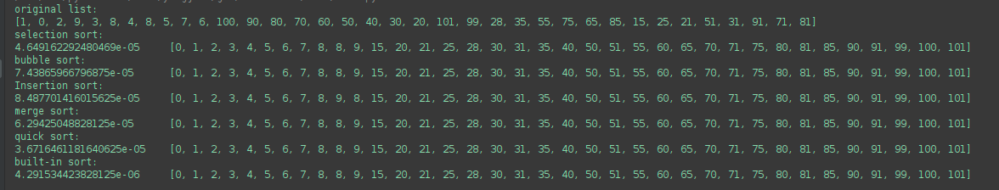

# Sort

## Selection sort
For a list of n elements, look at the first n-1 of them and find the 
max. Swap it with the last one, _if_ it is smaller than the last one.
Then look at the first n - 2 of them and find the max again. Swap with the 
second to the last.

This is an O(N2) algorithm

## Bubble sort
Compare 0 and 1, swap the bigger to 1. Then compare 1, and 2, swap the bigger
to 2. Keep on doing this until the end of the list. This will bubble 
the max to the end.
Now start from 0 again and bubble the second biggest to the second
last.

It is an O(N2) algorithm.

## Insertion sort
Keep a sublist sorted, and expand it by inserting new cards in to the
correct location one by one. 

This algorithm is called stable, because for elements with the same
value, we can keep their order.

Also an O(N2) algorithm.

## Merge sort

It contains two method. 
### Merge method
This method merges two _sorted_ lists.

Note because the method below only split a list into two
adjacent sublists, this merge method just need to merge
adjacent sublists.

### merge_sort_rec method
This is a recursive method. It will stop if the list to sort has two elements
If can just sort it.

If bigger than 2, then find the middle of the input list, and 
divide it into two.
Call itself to merge_sort each half.
Then call merge to merge the _sorted_ halves.

## Quick sort
It also contains two methods.

### Partition method
This method picks one element from the input list (normally the first element).
It is used as a pivot. Then it find out the pivot location for it.
A partitioned list has all the elements to the left of the pivot 
smaller than it, and to the right bigger than it.

It returns the pivot location.

### Quick_sort_rec method
It is a recursive method. It stops if the input list has length of
one. 
Otherwise, it calls the partition method to partition the input
list, and gets the pivot location.
Then it calls itself to handle the sublist from start to pivot, and from
pivot to the end.

## code
Python implementation of all four
[sort.py](sort.py)

## Comparison

## Trick
Quick sort is good for finding the ith largest, because
* if the pivot location happens to be i, then we can stop, even though
the whole list just partitioned, and not sorted yet.
* Even if the pivot position is not i, we just need to keep on
sorting the side that contains i. We don't need to worry about the 
other side. For example, if we are looking for the 5th largest, and
the first pivot location returned is 10, then we just need to worry about [0:10]
. [10:] is not relevant.

## Examples
### Lily's Homework
[lily's homework](https://www.hackerrank.com/challenges/lilys-homework/problem) One
important thing to realize is that when a list is sorted, the sum of 
|arr[i] - arr[i-1]| is minimum. 
With this in mind, this problem is essentially counting the swaps 
we need to make the input list sorted.

Two observations:
1. When swapping ith and jth elements, all the rest won't be affected. 
2. All the elements in the correct locations can be considred locked.
As far as we don't swap anyone of them, they will stay in the correct locations.

So we can find a convergent approach:
Find an element in wrong location, swap it with the one in its correct location. If the swapped in one is good, then we 
are done with this location. Otherwise swap the in-coming one to its
correct location. Repeat this until this location is good.
Keep on going until all elements are in the correct location.

How to track the correct locations of each element? 

Two tricks here:
1. Instead of count the swaps to make the incoming list sorted, we 
sort the list first, and then count the swaps we need to reverse it back
to the original
2. To track the location, we add an index to the list, and then sort it 
using the value.

In this particular example, once we are done with i = 1, the whole
list has been reversed back to the orginal. In general, this is not always
true.